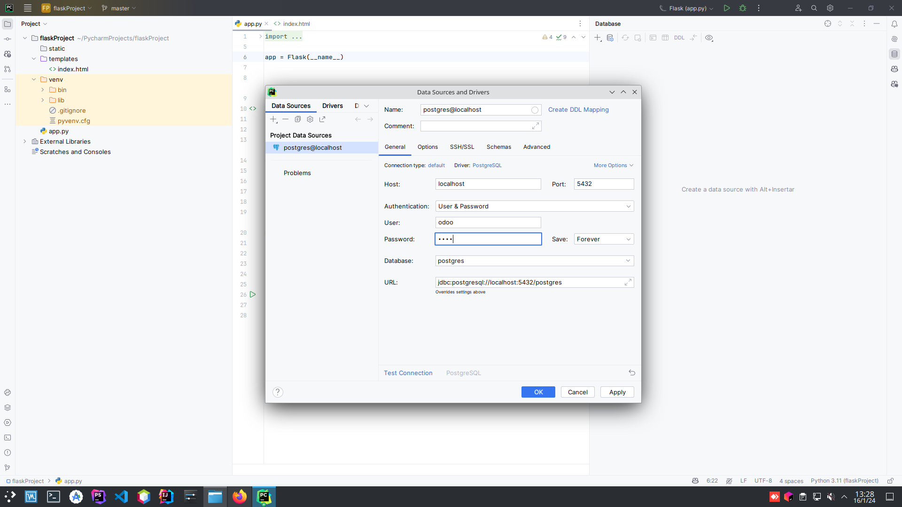
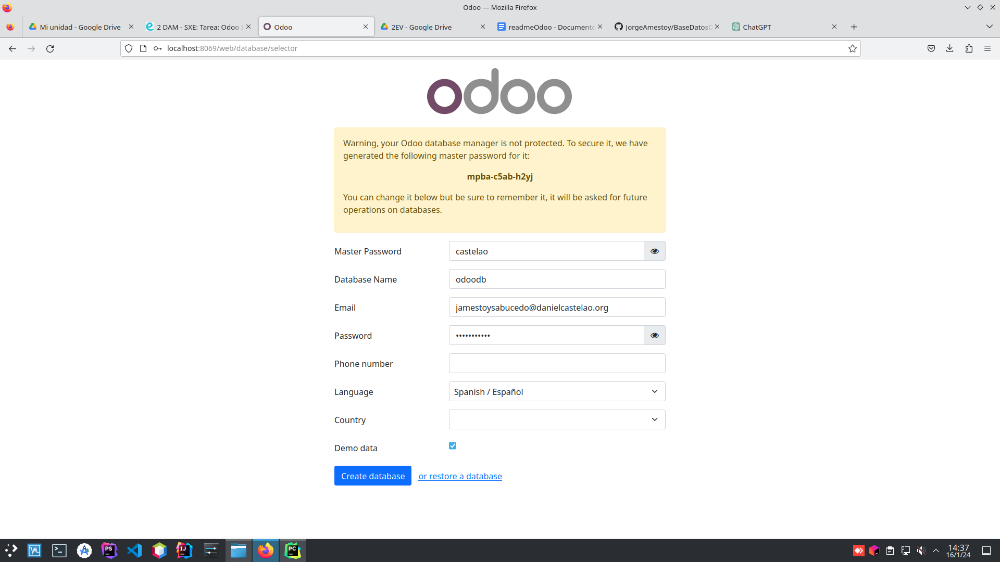
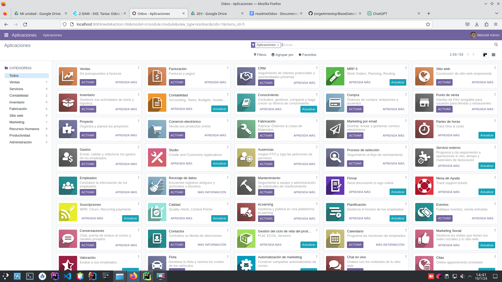

# ODOO
**Odoo** es un conjuntos de programas para ayudar a las empresas
a gestionar diferentes aspectos de su negocio. Entre sus características
destacan:
- Uso fácil
- Variación de módulos
- Buena adaptación a las necesidades 
- Versión comunitaria gratuita

El primer paso es buscar en [docker hub](https://hub.docker.com/) la imagen de Odoo. Así, creamos
un fichero docker-compose.yml en el proyecto con el siguiente contenido:
```
version: '3.1'
services:
  web:    
    image: odoo:16.0
    
    depends_on:
      - db
    ports:
      - "8069:8069"
  db:
    image: postgres:15
    environment:
      - POSTGRES_DB=postgres
      - POSTGRES_PASSWORD=odoo
      - POSTGRES_USER=odoo
    ports:
      - "5432:5432"
```
`version: '3.1`: indica la versión de docker-compose a usar.<br><br>
`services`: son los servicios que vamos a utilizar:
- web 
- db

En **web** la imagen a utilizar es la de *odoo:16.0.*
Además, indicamos que el puerto 8069 de la máquina host se mapea al puerto 8069 del contenedor, y que
depende del servicio **db**. Esto significa que cuando se ejecuta Docker Compose para iniciar los servicios, Docker Compose esperará a que el servicio db (PostgreSQL) esté iniciado antes de iniciar 
el servicio web (Odoo).<br><br>
En **db** señalamos que la imagen es la de *postgres:15.* 
Así, el puerto 5432 de la máquina host se mapea al puerto 5432 del contenedor.<br><br>
En **environment** mostramos las variables de entorno que se van a utilizar en dicho contenedor. En este caso, la base de datos se llama **postgres**, 
el usuario es **odoo** y la contraseña también es **odoo**.

Tras esto, configuramos la base de datos desde la propia interfaz del IDE, rellenando los campos tal y como especificamos en el **.yml**, y testeando
la conexión:

<br><br>

A continuación, desde la terminal y situado en el directorio
en el que se encuentra dicho archivo, arrancamos e iniciamos los contenedores con los comandos `docker-compose up -d` y `docker-compose start`.
En el caso de que hubiese un error por ocupación del puerto 5432 podríamos cambiar el puerto para dicho servicio y así liberarlo,
o  parar el servicio que está levantado en dicho puerto con:<br><br>
`netstat -putan | grep 5432`: para ver cuál se está utilizando <br><br>
`sudo service <nombreServicio> stop`: para detenerlo

Luego, escribimos la dirección IP en el navegador seguido 
del puerto definido previamente: *http://localhost:8069* , dando como resultado:<br><br>
<br><br>
Para finalizar, configuramos las credenciales y pulsamos **Create database** para entrar en Odoo:<br><br>
<br><br>


